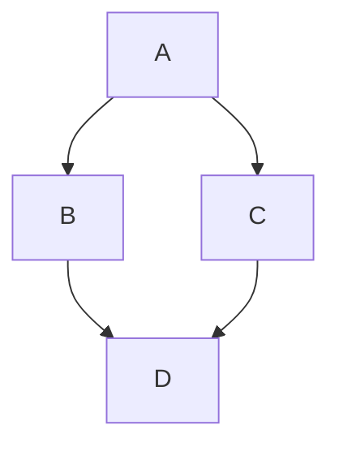
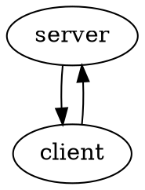

# Flow Chart

## Mermaid

- <https://mermaid.ai/open-source/intro/>
- <https://github.com/badboy/mdbook-mermaid>

~~~markdown

~~~

## Graphviz

- <https://graphviz.gitlab.io/>
- <https://github.com/dylanowen/mdbook-graphviz>

~~~markdown

~~~
